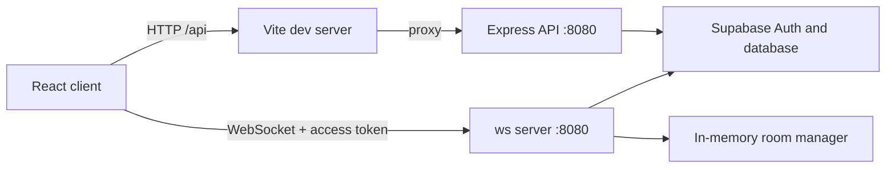

<div align="center">

# RELAY V2

### Real-time chat for the conversations worth keeping.

A room-based messaging app built with React, WebSockets, Express, and Supabase.

[Quick start](#quick-start) · [Architecture](#architecture) · [API](#http-api) · [WebSocket protocol](#websocket-protocol) · [Database](#supabase-data-model)

</div>

---

## At a glance

| | |
| --- | --- |
| **Client** | React 19, Vite 8, JavaScript |
| **Server** | Node.js, Express 5, `ws` |
| **Auth and data** | Supabase Auth, Supabase database |
| **Realtime** | Native WebSocket connections, room-scoped broadcasts |
| **Local ports** | Client `5173`, server `8080` |

Relay V2 includes email/password sign-up and login, saved auth sessions, a live chat feed, room switching and creation, message history, profile editing, and a responsive dark interface.

## Quick start

You need a recent Node.js release, npm, and a Supabase project with the tables described under [Supabase data model](#supabase-data-model).

### 1. Configure the server

Create `server/.env`:

```dotenv
SUPABASE_URL=https://<project-ref>.supabase.co
SUPABASE_KEY=<server-side-supabase-key>
PORT=8080
```

The server loads this file relative to `server/supabaseClient.js`. Keep this file out of version control. Never place a Supabase service-role key in the client or expose it in a browser bundle. Database permissions and Row Level Security policies must allow the server's configured key to perform the operations used by the app.

### 2. Install dependencies

Run these in separate terminal sessions:

```powershell
cd server
npm install
npm run dev
```

```powershell
cd client
npm install
npm run dev
```

Open the Vite URL printed in the client terminal, normally `http://localhost:5173`.

The Vite development server proxies `/api/*` requests to `http://localhost:8080`. WebSocket connections go directly to `ws://localhost:8080`.

## Architecture



The HTTP API and WebSocket server share one Node HTTP server. Authenticated sockets join database-backed rooms; messages are stored in Supabase and broadcast to sockets currently in that room. Room membership and broadcasts are held in process memory by `server/sockets/roomManager.js`; this project does **not** use Redis Pub/Sub. Room presence is lost when the server process restarts and is not shared across multiple server instances.

## Project layout

```text
client/
  src/
    components/       Auth, chat, sidebar, profile editor
    hooks/            WebSocket state and lifecycle
    App.jsx           Authenticated app and room state
    App.css           App and component styles
    index.css         Global styles
  vite.config.js      Local /api development proxy
server/
  api/                Signup, login, and profile routes
  sockets/            WebSocket protocol and in-memory rooms
  server.js           Express and WebSocket server entry point
  supabaseClient.js   Server-side Supabase client
  .env                Local server configuration (not committed)
```

## HTTP API

The API listens on the server port, normally `8080`. JSON endpoints return an `error` field for failures.

| Method | Path | Purpose |
| --- | --- | --- |
| `POST` | `/api/signup` | Create an account with `{ "email", "password" }` |
| `POST` | `/api/login` | Sign in with `{ "email", "password" }` |
| `GET` | `/api/profile/:id` | Fetch a profile; `data` is `null` when no row exists |
| `PUT` | `/api/profile/update` | Create or update the signed-in user's profile |

Signup and login return Supabase auth data, including `data.session.access_token` when a session is issued. If email confirmation is enabled in Supabase, signup may create the account without issuing a session; the client asks the user to verify their email and sign in.

Profile updates require this header:

```http
Authorization: Bearer <access_token>
```

The request body accepts `full_name`, `username`, `bio`, and `avatar_url`. The server uses the token to determine which profile ID to upsert.

## WebSocket protocol

Connect with the Supabase access token:

```text
ws://localhost:8080?token=<access_token>
```

All frames are JSON.

### Client to server

Join a room by name or UUID:

```json
{"type":"JOIN_ROOM","payload":{"roomId":"general"}}
```

Send a message after joining:

```json
{"type":"SEND_MESSAGE","payload":{"content":"Hello, room."}}
```

### Server to client

| Type | Payload | Meaning |
| --- | --- | --- |
| `JOIN_SUCCESS` | Room name, database room ID, active users | Join completed |
| `ROOM_HISTORY` | Array of `{ id, sender_id, content, created_at }` | Up to 50 room messages |
| `NEW_MESSAGE` | `{ id, sender_id, content, created_at }` | A message was saved and broadcast |
| `USER_JOINED` | User and active-user list | A member joined |
| `USER_LEFT` | User and active-user list | A member left |
| `error` | `{ "error": "description" }` | A request failed |

Connections without a valid token are closed with code `4001`. The server sends WebSocket ping frames every 30 seconds to detect inactive connections.

## Supabase data model

The server expects these tables and columns:

- **`rooms`**: `id` (UUID primary key), `name` (text). Room names are looked up case-insensitively; missing rooms are created when a user joins them.
- **`messages`**: `id`, `room_id` (references `rooms.id`), `sender_id` (Supabase auth user ID), `content`, `created_at`. Room history is limited to 50 rows.
- **`profiles`**: `id` (Supabase auth user ID), `full_name`, `username`, `bio`, `avatar_url`, `updated_at`.

Apply database constraints and Row Level Security policies appropriate to your deployment. The server must be able to read and write the tables above. The profile update route validates the access token before writing; public profile reads are currently available through `GET /api/profile/:id`.

## Development commands

Run commands from their package directory:

```powershell
# client/
npm run dev
npm run lint
npm run build
npm run preview
```

```powershell
# server/
npm run dev
```

## Deployment notes

The checked-in Vite proxy is for local development only. In production, serve the client and route `/api` to the Express server through your hosting platform or reverse proxy. Configure the WebSocket endpoint to use `wss://` behind HTTPS; the current client hook targets `ws://localhost:8080` for local development and must be configured for a deployed server.

The current room manager is process-local. A multi-instance deployment needs shared room coordination and sticky or otherwise coordinated WebSocket routing; no Redis integration is configured in this repository.
